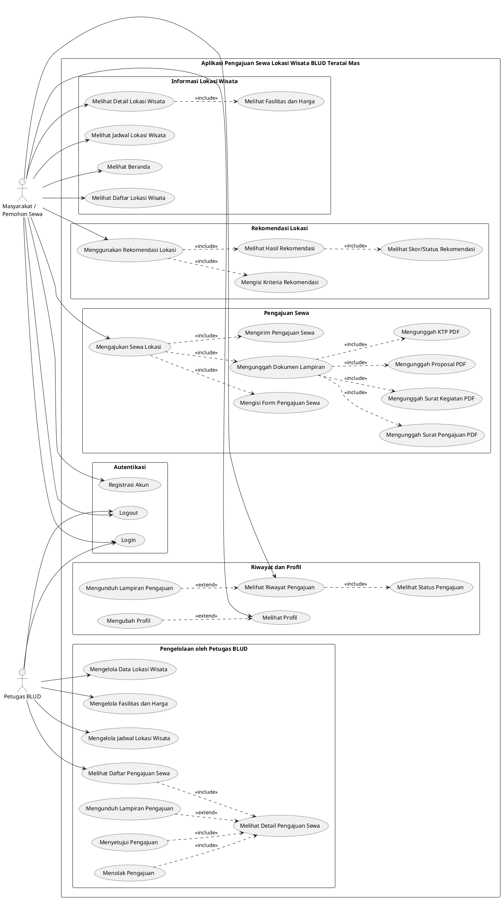

# 4.1.3 Perancangan Sistem
## 4.1.3.1 Use Case Diagram

Use case diagram merupakan diagram yang menggambarkan interaksi antara sistem dan aktor eksternal. Diagram ini mendefinisikan fungsionalitas yang disediakan oleh sistem dan bagaimana aktor menggunakannya untuk mencapai tujuan tertentu. Pada perancangan sistem ini, use case diagram difokuskan pada fitur-fitur yang terdapat pada aplikasi pengajuan sewa berbasis mobile, serta fungsionalitas pengelolaan data pendukung dan verifikasi pengajuan oleh petugas melalui *dashboard* web yang terhubung.

Aktor yang diidentifikasi pada sistem ini terdiri dari dua pihak utama, yaitu Masyarakat / Pemohon Sewa yang bertindak sebagai pengguna aplikasi mobile, dan Petugas BLUD yang mengelola operasional dan memverifikasi pengajuan.

**Tabel 4.x Aktor Sistem**
| Aktor | Deskripsi | Hak Akses Utama |
|---|---|---|
| Masyarakat / Pemohon Sewa | Masyarakat umum atau instansi yang menggunakan aplikasi mobile untuk mencari informasi lokasi wisata dan melakukan pengajuan sewa. | Mengakses informasi wisata, melakukan pendaftaran, menggunakan fitur rekomendasi lokasi, mengirimkan form pengajuan sewa lengkap dengan dokumen lampiran, dan melacak status pengajuannya. |
| Petugas BLUD | Staf pengelola (admin) dari BLUD Teratai Mas yang bertugas memverifikasi pengajuan dan memperbarui data informasi lokasi wisata. | Mengelola data lokasi wisata, fasilitas, jadwal kegiatan, melihat detail pengajuan sewa, mengunduh dokumen lampiran pengajuan, serta memberikan persetujuan atau penolakan terhadap pengajuan sewa. |

Tabel berikut menyajikan daftar *use case* yang terdapat dalam sistem aplikasi pengajuan sewa berbasis mobile beserta deskripsi fungsinya.

**Tabel 4.y Daftar Use Case**
| Kode | Aktor | Use Case | Deskripsi |
|---|---|---|---|
| UC-01 | Masyarakat / Pemohon Sewa | Registrasi Akun | Proses pembuatan akun baru agar masyarakat dapat login ke dalam aplikasi. |
| UC-02 | Masyarakat / Pemohon Sewa, Petugas BLUD | Login | Proses autentikasi untuk masuk ke dalam sistem sesuai hak akses. |
| UC-03 | Masyarakat / Pemohon Sewa, Petugas BLUD | Logout | Proses keluar dari sesi akun yang sedang aktif. |
| UC-04 | Masyarakat / Pemohon Sewa | Melihat Beranda | Proses menampilkan halaman utama aplikasi setelah login. |
| UC-05 | Masyarakat / Pemohon Sewa | Melihat Daftar Lokasi Wisata | Proses menampilkan seluruh daftar lokasi wisata yang tersedia di BLUD Teratai Mas. |
| UC-06 | Masyarakat / Pemohon Sewa | Melihat Detail Lokasi Wisata | Proses menampilkan informasi rinci dari lokasi wisata yang dipilih. |
| UC-07 | Masyarakat / Pemohon Sewa | Melihat Fasilitas dan Harga | Proses menampilkan daftar fasilitas dan harga yang tersedia pada lokasi wisata tertentu (Include dari UC-06). |
| UC-08 | Masyarakat / Pemohon Sewa | Melihat Jadwal Lokasi Wisata | Proses menampilkan kalender/jadwal ketersediaan atau acara pada lokasi wisata. |
| UC-09 | Masyarakat / Pemohon Sewa | Menggunakan Rekomendasi Lokasi | Proses sistem memberikan rekomendasi lokasi yang sesuai dengan kebutuhan pemohon. |
| UC-10 | Masyarakat / Pemohon Sewa | Mengisi Kriteria Rekomendasi | Proses pengguna memasukkan kriteria (tujuan, fasilitas) untuk rekomendasi (Include dari UC-09). |
| UC-11 | Masyarakat / Pemohon Sewa | Melihat Hasil Rekomendasi | Proses menampilkan hasil rekomendasi berdasarkan kriteria yang dimasukkan (Include dari UC-09). |
| UC-12 | Masyarakat / Pemohon Sewa | Melihat Skor/Status Rekomendasi | Proses melihat detail kecocokan skor rekomendasi lokasi (Include dari UC-11). |
| UC-13 | Masyarakat / Pemohon Sewa | Mengajukan Sewa Lokasi | Proses utama pembuatan permohonan pengajuan penyewaan lokasi wisata. |
| UC-14 | Masyarakat / Pemohon Sewa | Mengisi Form Pengajuan Sewa | Proses melengkapi data kegiatan, waktu sewa, dan informasi PIC (Include dari UC-13). |
| UC-15 | Masyarakat / Pemohon Sewa | Mengunggah Dokumen Lampiran | Proses melampirkan berkas yang dibutuhkan untuk verifikasi (Include dari UC-13). |
| UC-16 | Masyarakat / Pemohon Sewa | Mengunggah Proposal PDF | Proses melampirkan file proposal kegiatan (Include dari UC-15). |
| UC-17 | Masyarakat / Pemohon Sewa | Mengunggah KTP PDF | Proses melampirkan file scan KTP penanggung jawab (Include dari UC-15). |
| UC-18 | Masyarakat / Pemohon Sewa | Mengunggah Surat Pengajuan PDF | Proses melampirkan surat permohonan penyewaan (Include dari UC-15). |
| UC-19 | Masyarakat / Pemohon Sewa | Mengunggah Surat Kegiatan PDF | Proses melampirkan surat izin/rekomendasi kegiatan (Include dari UC-15). |
| UC-20 | Masyarakat / Pemohon Sewa | Mengirim Pengajuan Sewa | Proses pengiriman seluruh data pengajuan kepada Petugas BLUD setelah divalidasi sistem (Include dari UC-13). |
| UC-21 | Masyarakat / Pemohon Sewa | Melihat Riwayat Pengajuan | Proses melihat daftar pengajuan sewa yang pernah atau sedang dilakukan. |
| UC-22 | Masyarakat / Pemohon Sewa | Melihat Status Pengajuan | Proses mengecek apakah pengajuan dalam status *Pending*, *Approved*, atau *Rejected* (Include dari UC-21). |
| UC-23 | Masyarakat / Pemohon Sewa | Mengunduh Lampiran Pengajuan | Proses pengguna mengunduh kembali dokumen yang telah diunggah atau surat balasan (Extend dari UC-21). |
| UC-24 | Masyarakat / Pemohon Sewa | Melihat Profil | Proses menampilkan informasi profil pengguna. |
| UC-25 | Masyarakat / Pemohon Sewa | Mengubah Profil | Proses memperbarui informasi profil pengguna seperti nama dan nomor HP (Extend dari UC-24). |
| UC-26 | Petugas BLUD | Mengelola Data Lokasi Wisata | Proses CRUD (Create, Read, Update, Delete) informasi lokasi wisata. |
| UC-27 | Petugas BLUD | Mengelola Fasilitas dan Harga | Proses mengelola daftar ketersediaan fasilitas dan harganya pada setiap lokasi. |
| UC-28 | Petugas BLUD | Mengelola Jadwal Lokasi Wisata | Proses menetapkan ketersediaan tanggal atau agenda kegiatan pada lokasi. |
| UC-29 | Petugas BLUD | Melihat Daftar Pengajuan Sewa | Proses melihat rekapitulasi semua pengajuan sewa yang masuk ke sistem. |
| UC-30 | Petugas BLUD | Melihat Detail Pengajuan Sewa | Proses memeriksa rincian form pengajuan dan dokumen yang diunggah pemohon (Include dari UC-29). |
| UC-31 | Petugas BLUD | Mengunduh Lampiran Pengajuan | Proses petugas mengunduh dokumen KTP, Proposal, dll untuk divalidasi (Extend dari UC-30). |
| UC-32 | Petugas BLUD | Menyetujui Pengajuan | Proses mengubah status pengajuan menjadi *Approved* jika data valid (Include dari UC-30). |
| UC-33 | Petugas BLUD | Menolak Pengajuan | Proses mengubah status pengajuan menjadi *Rejected* dengan memberikan alasan jika data tidak valid (Include dari UC-30). |

*Catatan Verifikasi Fitur:*
Fitur-fitur yang dideskripsikan di atas telah divalidasi berdasarkan *source code* pada aplikasi Flutter (`submission_form_screen.dart`, `submission_history_screen.dart`, `recommendation_screen.dart`, dll) dan modul API backend Laravel (`SubmissionController.php`, `WisataApiController.php`, dll). Fitur administrasi Petugas BLUD sengaja dibatasi hanya pada hal yang berkaitan langsung dengan sinkronisasi data aplikasi mobile.

**Diagram Use Case**

